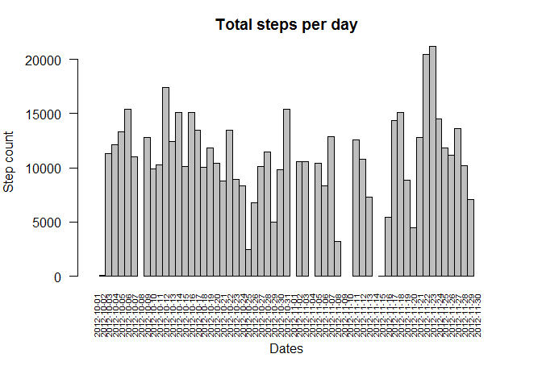
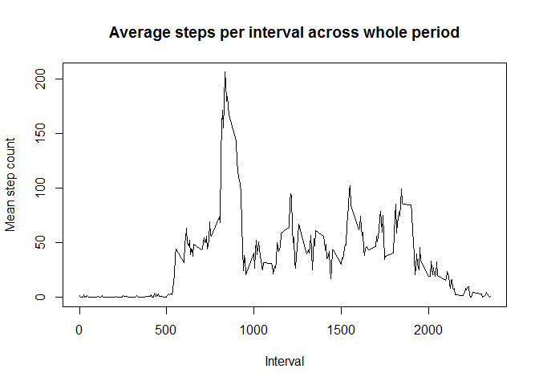
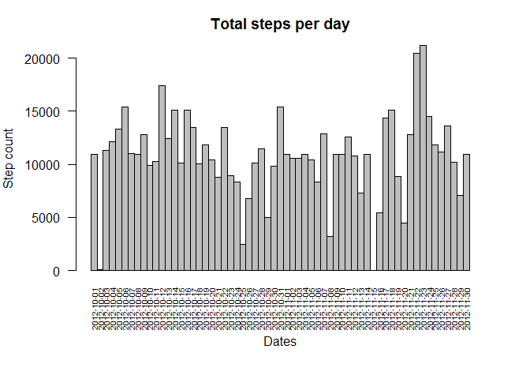
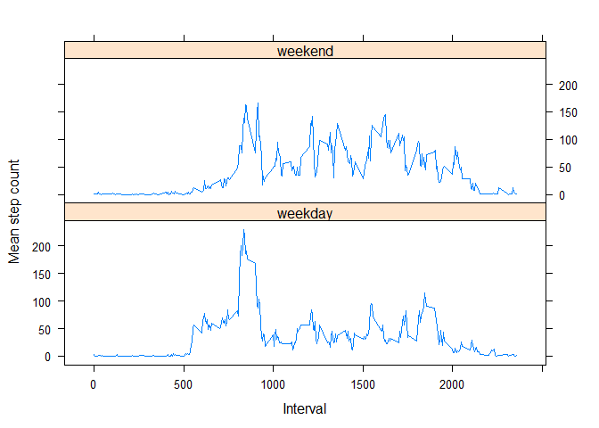

# Reproducible Research: Peer Assessment 1

## Loading and preprocessing the data
1. Unzip and load the source data file  

```r
## Unzip the source file
unzip("activity.zip")

## Load it in
sourceData <- read.csv("activity.csv")

## Examine the first few rows
head(sourceData)
```

```
##   steps       date interval
## 1    NA 2012-10-01        0
## 2    NA 2012-10-01        5
## 3    NA 2012-10-01       10
## 4    NA 2012-10-01       15
## 5    NA 2012-10-01       20
## 6    NA 2012-10-01       25
```
2. No transformation of data required as it appears well structured with NA used for missing values.
  
## What is mean total number of steps taken per day?
1. Table showing daily total step count:

```r
## First create an aggregated(sum) dataset at interval level
dailyAggSteps <- setNames(
                                aggregate(sourceData$steps, list(sourceData$date), sum), 
                                c("Date", "Steps")
                        )

## Load the xtable library for neat display
library(xtable)

## Create the table of data
xt <- xtable(dailyAggSteps, pad=TRUE)

## And display it
print(xt, type="html")
```

<!-- html table generated in R 3.2.2 by xtable 1.8-0 package -->
<!-- Mon Nov 09 17:21:53 2015 -->
<table border=1>
<tr> <th>  </th> <th> Date </th> <th> Steps </th>  </tr>
  <tr> <td align="right"> 1 </td> <td> 2012-10-01 </td> <td align="right">  </td> </tr>
  <tr> <td align="right"> 2 </td> <td> 2012-10-02 </td> <td align="right"> 126 </td> </tr>
  <tr> <td align="right"> 3 </td> <td> 2012-10-03 </td> <td align="right"> 11352 </td> </tr>
  <tr> <td align="right"> 4 </td> <td> 2012-10-04 </td> <td align="right"> 12116 </td> </tr>
  <tr> <td align="right"> 5 </td> <td> 2012-10-05 </td> <td align="right"> 13294 </td> </tr>
  <tr> <td align="right"> 6 </td> <td> 2012-10-06 </td> <td align="right"> 15420 </td> </tr>
  <tr> <td align="right"> 7 </td> <td> 2012-10-07 </td> <td align="right"> 11015 </td> </tr>
  <tr> <td align="right"> 8 </td> <td> 2012-10-08 </td> <td align="right">  </td> </tr>
  <tr> <td align="right"> 9 </td> <td> 2012-10-09 </td> <td align="right"> 12811 </td> </tr>
  <tr> <td align="right"> 10 </td> <td> 2012-10-10 </td> <td align="right"> 9900 </td> </tr>
  <tr> <td align="right"> 11 </td> <td> 2012-10-11 </td> <td align="right"> 10304 </td> </tr>
  <tr> <td align="right"> 12 </td> <td> 2012-10-12 </td> <td align="right"> 17382 </td> </tr>
  <tr> <td align="right"> 13 </td> <td> 2012-10-13 </td> <td align="right"> 12426 </td> </tr>
  <tr> <td align="right"> 14 </td> <td> 2012-10-14 </td> <td align="right"> 15098 </td> </tr>
  <tr> <td align="right"> 15 </td> <td> 2012-10-15 </td> <td align="right"> 10139 </td> </tr>
  <tr> <td align="right"> 16 </td> <td> 2012-10-16 </td> <td align="right"> 15084 </td> </tr>
  <tr> <td align="right"> 17 </td> <td> 2012-10-17 </td> <td align="right"> 13452 </td> </tr>
  <tr> <td align="right"> 18 </td> <td> 2012-10-18 </td> <td align="right"> 10056 </td> </tr>
  <tr> <td align="right"> 19 </td> <td> 2012-10-19 </td> <td align="right"> 11829 </td> </tr>
  <tr> <td align="right"> 20 </td> <td> 2012-10-20 </td> <td align="right"> 10395 </td> </tr>
  <tr> <td align="right"> 21 </td> <td> 2012-10-21 </td> <td align="right"> 8821 </td> </tr>
  <tr> <td align="right"> 22 </td> <td> 2012-10-22 </td> <td align="right"> 13460 </td> </tr>
  <tr> <td align="right"> 23 </td> <td> 2012-10-23 </td> <td align="right"> 8918 </td> </tr>
  <tr> <td align="right"> 24 </td> <td> 2012-10-24 </td> <td align="right"> 8355 </td> </tr>
  <tr> <td align="right"> 25 </td> <td> 2012-10-25 </td> <td align="right"> 2492 </td> </tr>
  <tr> <td align="right"> 26 </td> <td> 2012-10-26 </td> <td align="right"> 6778 </td> </tr>
  <tr> <td align="right"> 27 </td> <td> 2012-10-27 </td> <td align="right"> 10119 </td> </tr>
  <tr> <td align="right"> 28 </td> <td> 2012-10-28 </td> <td align="right"> 11458 </td> </tr>
  <tr> <td align="right"> 29 </td> <td> 2012-10-29 </td> <td align="right"> 5018 </td> </tr>
  <tr> <td align="right"> 30 </td> <td> 2012-10-30 </td> <td align="right"> 9819 </td> </tr>
  <tr> <td align="right"> 31 </td> <td> 2012-10-31 </td> <td align="right"> 15414 </td> </tr>
  <tr> <td align="right"> 32 </td> <td> 2012-11-01 </td> <td align="right">  </td> </tr>
  <tr> <td align="right"> 33 </td> <td> 2012-11-02 </td> <td align="right"> 10600 </td> </tr>
  <tr> <td align="right"> 34 </td> <td> 2012-11-03 </td> <td align="right"> 10571 </td> </tr>
  <tr> <td align="right"> 35 </td> <td> 2012-11-04 </td> <td align="right">  </td> </tr>
  <tr> <td align="right"> 36 </td> <td> 2012-11-05 </td> <td align="right"> 10439 </td> </tr>
  <tr> <td align="right"> 37 </td> <td> 2012-11-06 </td> <td align="right"> 8334 </td> </tr>
  <tr> <td align="right"> 38 </td> <td> 2012-11-07 </td> <td align="right"> 12883 </td> </tr>
  <tr> <td align="right"> 39 </td> <td> 2012-11-08 </td> <td align="right"> 3219 </td> </tr>
  <tr> <td align="right"> 40 </td> <td> 2012-11-09 </td> <td align="right">  </td> </tr>
  <tr> <td align="right"> 41 </td> <td> 2012-11-10 </td> <td align="right">  </td> </tr>
  <tr> <td align="right"> 42 </td> <td> 2012-11-11 </td> <td align="right"> 12608 </td> </tr>
  <tr> <td align="right"> 43 </td> <td> 2012-11-12 </td> <td align="right"> 10765 </td> </tr>
  <tr> <td align="right"> 44 </td> <td> 2012-11-13 </td> <td align="right"> 7336 </td> </tr>
  <tr> <td align="right"> 45 </td> <td> 2012-11-14 </td> <td align="right">  </td> </tr>
  <tr> <td align="right"> 46 </td> <td> 2012-11-15 </td> <td align="right">  41 </td> </tr>
  <tr> <td align="right"> 47 </td> <td> 2012-11-16 </td> <td align="right"> 5441 </td> </tr>
  <tr> <td align="right"> 48 </td> <td> 2012-11-17 </td> <td align="right"> 14339 </td> </tr>
  <tr> <td align="right"> 49 </td> <td> 2012-11-18 </td> <td align="right"> 15110 </td> </tr>
  <tr> <td align="right"> 50 </td> <td> 2012-11-19 </td> <td align="right"> 8841 </td> </tr>
  <tr> <td align="right"> 51 </td> <td> 2012-11-20 </td> <td align="right"> 4472 </td> </tr>
  <tr> <td align="right"> 52 </td> <td> 2012-11-21 </td> <td align="right"> 12787 </td> </tr>
  <tr> <td align="right"> 53 </td> <td> 2012-11-22 </td> <td align="right"> 20427 </td> </tr>
  <tr> <td align="right"> 54 </td> <td> 2012-11-23 </td> <td align="right"> 21194 </td> </tr>
  <tr> <td align="right"> 55 </td> <td> 2012-11-24 </td> <td align="right"> 14478 </td> </tr>
  <tr> <td align="right"> 56 </td> <td> 2012-11-25 </td> <td align="right"> 11834 </td> </tr>
  <tr> <td align="right"> 57 </td> <td> 2012-11-26 </td> <td align="right"> 11162 </td> </tr>
  <tr> <td align="right"> 58 </td> <td> 2012-11-27 </td> <td align="right"> 13646 </td> </tr>
  <tr> <td align="right"> 59 </td> <td> 2012-11-28 </td> <td align="right"> 10183 </td> </tr>
  <tr> <td align="right"> 60 </td> <td> 2012-11-29 </td> <td align="right"> 7047 </td> </tr>
  <tr> <td align="right"> 61 </td> <td> 2012-11-30 </td> <td align="right">  </td> </tr>
   </table>
  
  
2. Historgram of the above data showing the daily total step counts:  

```r
## Draw the histogram chart
with(dailyAggSteps, {
    par(las=2, mar=c(7,5,3,3), mgp=c(4,1,0))
    barplot(
        height=Steps,
        main="Total steps per day",
        xlab="Dates",
        cex.names=0.6,
        ylab="Step count",
        names.arg=Date,
        space=c(0)
    )
})
```

 


3. Calculate the mean and median total of steps per day (ignoring NA values):  

```r
## Calculate the mean from the daily aggregate dataset
dailyMeanSteps <- mean(dailyAggSteps$Steps, na.rm = TRUE)

## Calculate the median from the daily aggregate dataset
dailyMedianSteps <- median(dailyAggSteps$Steps, na.rm = TRUE)
```
  
The mean is **10766.2** and the median value is **10765**


## What is the average daily activity pattern?

1. A timeseries plot showing the average step count per interval:

```r
## First create an aggregated(mean) dataset at interval level
intervalMeanSteps <- setNames(
                                aggregate(data=sourceData, steps~interval, FUN=mean, na.action=na.omit),
                                c("Interval", "MeanSteps")
                        )

## And then plot the result as a timeseries
with(intervalMeanSteps, {
    plot(
        x=Interval,
        y=MeanSteps,
        type="l",
        main="Average steps per interval across whole period",
        xlab="Interval",
        ylab="Mean step count"
        
    )
})
```

 
  
  
2. Find the 5-minute interval with the maximum number of steps

```r
## Calculate the max value
intervalMax <- intervalMeanSteps[intervalMeanSteps$MeanSteps==max(intervalMeanSteps$MeanSteps),]
```
The maximum average step count occurs in interval **835** to **840** with an average **206.17** steps.


## Imputing missing values

1. Count of the number of rows with missing values:

```r
## Do the calculation
countNA <- nrow(subset(sourceData, is.na(sourceData$steps)))
```
  
There are **2304** rows with missing values.
  
2. We'll use the previously calculated 5-minute interval average step counts to replace NA values.
3. Create the new dataset with the missing data filled in:

```r
##First get the original step counts into a dataframe
stepCountValues <- data.frame(sourceData$steps)

## Use tapply to find and replace NA values with corresponding averages (rounded up to full steps)
stepCountValues[is.na(stepCountValues),] <- 
        ceiling(tapply(X=sourceData$steps, INDEX=sourceData$interval, FUN=mean, na.rm=TRUE))

## Bind the new and original data into an imputed dataset
imputedData <- setNames(
                                cbind(stepCountValues, sourceData[,2:3]),
                                c("Steps", "Date", "Interval")
                        )

## Examine the resulting dataset
head(imputedData)
```

```
##   Steps       Date Interval
## 1     2 2012-10-01        0
## 2     1 2012-10-01        5
## 3     1 2012-10-01       10
## 4     1 2012-10-01       15
## 5     1 2012-10-01       20
## 6     3 2012-10-01       25
```

4. A historgram showing the new daily total step counts: 

```r
## Firast create an aggregated(sum) dataset at day level for imputed dataset
newDailyAggSteps <- setNames(
                                aggregate(imputedData$Steps, list(imputedData$Date), sum), 
                                c("Date", "Steps")
                        )
## Calculate the mean and median total of steps per day (missing values imputed)
newDailyMeanSteps <- mean(newDailyAggSteps$Steps, na.rm = TRUE)
newDailyMedianSteps <- median(newDailyAggSteps$Steps, na.rm = TRUE)

## Now draw a historgram showing the new daily total step counts 
with(newDailyAggSteps, {
    par(las=2, mar=c(7,5,3,3), mgp=c(4,1,0))
    barplot(
        height=Steps,
        main="Total steps per day",
        xlab="Dates",
        cex.names=0.6,
        ylab="Step count",
        names.arg=Date,
        space=c(0)
    )
})
```

 

Replacing missing values with the interval average caused both mean and median values to increase with the Mean going from **10766.2** to **10784.9** and the Median going from **10765** to **10909**.

## Are there differences in activity patterns between weekdays and weekends?
  
1. Classify the rows by day type; weekday or weekend and calculate average steps by that classification.

```r
## Use tapply and custom func to classify dates as weekday or weekend and add to dataframe
dateDayClass <- data.frame(sapply(X = imputedData$Date, FUN = 
                        function(day) {
                                if (weekdays(as.Date(day)) %in% 
                                    c("Monday", "Tuesday", "Wednesday", "Thursday", "Friday")) {
                                        day <- "weekday"
                                } 
                                else {
                                        day <- "weekend"
                                }
                        }
                ))
## Bind result back to target dataset and name the cols
newDataWithDayClass <- setNames(cbind(imputedData, dateDayClass),
                                c("Steps", "Date", "Interval", "DayClass"))

## Calculate the mean number of steps by interval by day classification:
dayClassMeanIntSteps <- aggregate(
    data=newDataWithDayClass,
    Steps ~ DayClass + Interval,
    FUN=mean
)

## Examine the result
head(dayClassMeanIntSteps)
```

```
##   DayClass Interval     Steps
## 1  weekday        0 2.2888889
## 2  weekend        0 0.2500000
## 3  weekday        5 0.5333333
## 4  weekend        5 0.1250000
## 5  weekday       10 0.2888889
## 6  weekend       10 0.1250000
```

2. Timeseries panel plot showing the average step count per interval for both weekday and weekend day classes:

```r
## Load the lattice package
library("lattice")
## Create the panel plot
xyplot(
    type="l",
    data=dayClassMeanIntSteps,
    Steps ~ Interval | DayClass,
    xlab="Interval",
    ylab="Mean step count",
    layout=c(1,2)
)
```

 
